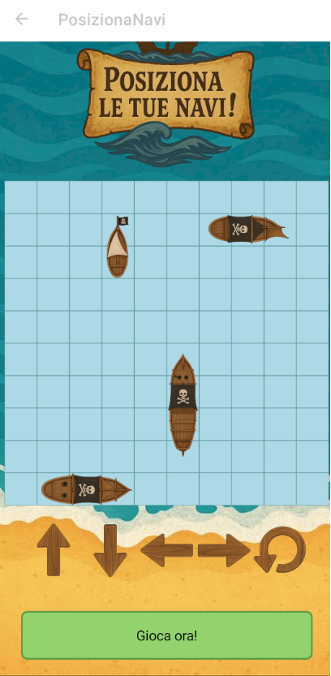
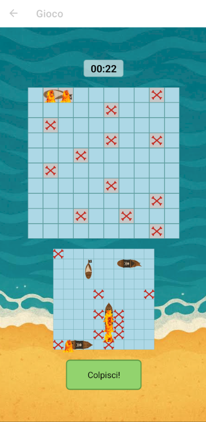

# 🏴‍☠️ Battaglia Navale

**Battaglia Navale** è un gioco mobile ispirato alla classica Battaglia Navale, con un tocco piratesco!  
Affronta un bot nemico in scontri strategici per il dominio dei sette mari.

⚓ *Sviluppato con .NET MAUI per Android*

---

## 📲 Installazione (APK)

Puoi scaricare e installare l'applicazione direttamente da questo link:

🔗 [Download APK via Google Drive](https://drive.google.com/file/d/1lCkjrD2ZJCD4b7f0J8blEs814RoVf7vT/view?usp=sharing)

📦 **Assicurati di abilitare l'installazione da origini sconosciute** sul tuo dispositivo Android.

---

## 🎮 Come si gioca

La griglia è fissa: **10x10**

Hai 4 navi:

- 🛶 1 da 2 celle  
- ⛵ 2 da 3 celle  
- 🚢 1 da 4 celle  

Si gioca contro un **bot** con un minimo di intelligenza (non spara a caso!).  
Posiziona le tue navi, attacca e cerca di affondare tutte le navi nemiche prima che lo faccia il bot.

---

## ✨ Funzionalità

- 🎨 UI a tema pirata  
- 🤖 Partita singola contro l’IA  
- 📱 Layout e gameplay mobile-friendly  
- 💥 Animazioni base per colpi a segno e affondamenti  

---

## 🛠️ Tecnologia

- **Linguaggio:** C#  
- **Framework:** .NET MAUI *(solo Android per ora)*  
- **Piattaforma:** Android 10+  

---

## 📷 Screenshot

